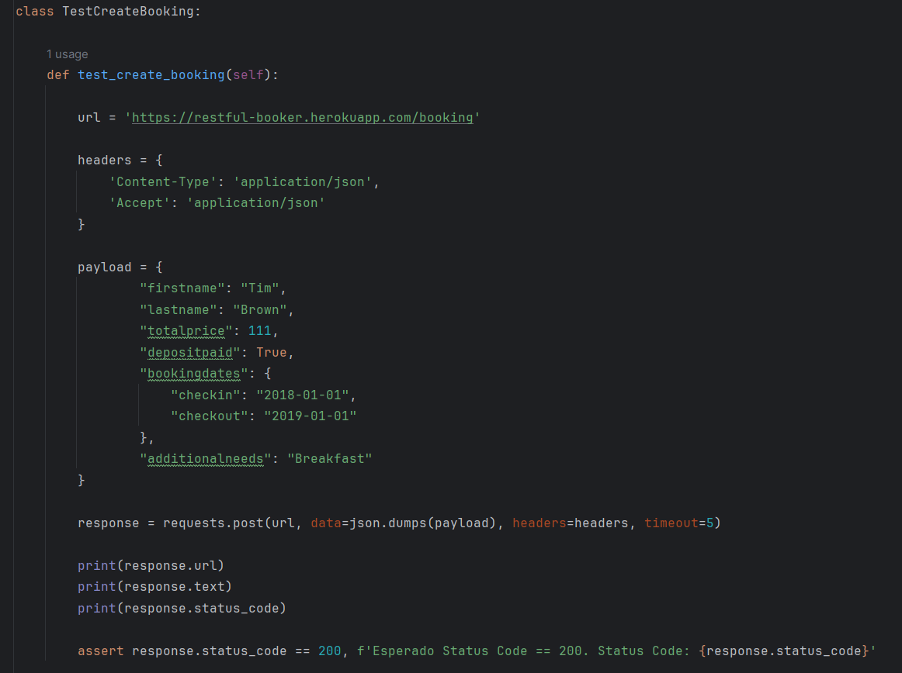

# Automação de testes de API com Python + Requests

 
> Python + Requests para automação de testes de API

 Projeto realizado durante estudos práticos
 
## 📚 Tópicos

- Python com a biblioteca Requests para realização de requisições automatizadas
- Automação de Testes de API consumindo a API pública 'restful-booker' (https://restful-booker.herokuapp.com/apidoc/index.html)

## 🔧 Ferramentas e Tecnologias

- Python (`v3.11.5`)
- Requests (`v2.31.0`)
- Pytest (`v8.0.0`)
- pip (`v24.0`)

## 🔧 Testes

- Execute `pytest .\test_gerar_token.py` para executar o teste.
- Execute `pytest .\test_get_booking_ids.py` para executar o teste.
- Execute `pytest .\test_get_booking.py` para executar o teste.
- Execute `pytest .\test_update_booking.py` para executar o teste.
- Execute `pytest .\test_partial_update_booking.py` para executar o teste.
- Execute `pytest .\test_create_booking.py` para executar o teste.
- Execute `pytest .\test_delete_booking.py` para executar o teste.

## 🔗 Contato

mykallella@gmail.com
